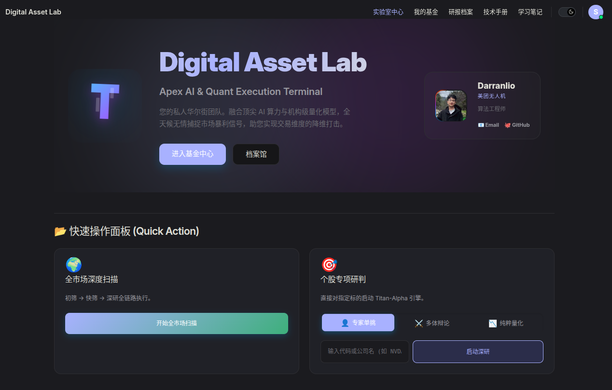
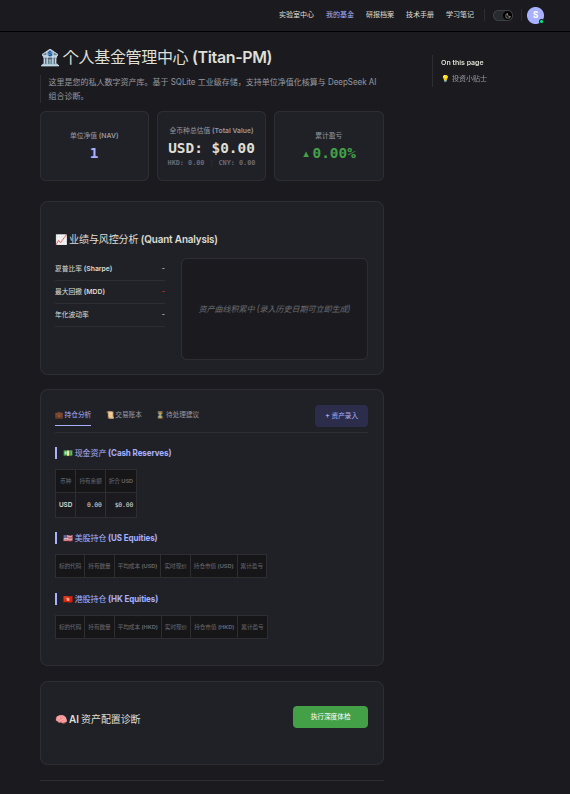
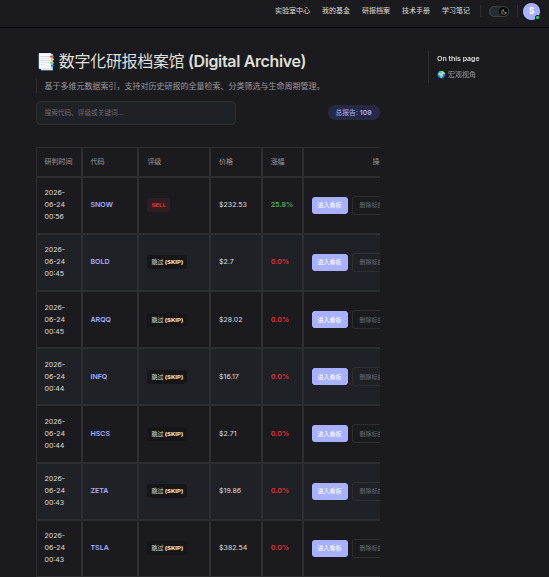

# Titan-Lite
> **Apex AI & Quant Execution Terminal**

Titan-Lite 是一款基于大模型认知博弈与量化算法的个人投资决策终端。它结合了机构级的数据分析管线与多智能体（Multi-Agent）决策架构，致力于成为您的私人华尔街团队，在复杂多变的市场中捕捉高确定性的交易信号。

---

## 📸 界面展示 (Screenshots)

### 沉浸式操作面板 (Control Panel)


### 个人基金管理 (Portfolio Management)


### 智能研报档案馆 (Digital Archive)


---

## 🌟 核心特性 (Features)

1. **三维分析模式 (Analysis Modes)**：
   - **单兵模式 (Solo)**：极速研判。单次 LLM 请求即可融合基本面、资金面与技术面，快速出具研报，极致节省 Token 成本。
   - **纯粹量化 (Quant)**：绕过大模型的主观偏见。底层调用类似于“文艺复兴科技”风格的数理统计、均值回归与风险模型，输出硬核指标与严格的凯利公式仓位建议。
   - **多体辩论 (Debate)**：由多头、空头、风控官与基金经理 (PM) 组成的多智能体圆桌会议，对目标标的进行深度博弈与逻辑交叉验证，避免单向思维盲区。
2. **全市场深度扫描 (Global Capital Scan)**：
   - 一键扫描全球市场，自动从基本面与估值面进行初筛，提取行业热力图，并针对核心潜力股池进行批量研判（支持多进程并发）。
3. **沉浸式控制面板 (Control Panel)**：
   - 基于 Vue + VitePress 构建的高级前端界面，提供研报归档、动态日志追踪以及投资组合的可视化管理。

---

## 🛠️ 安装与部署 (Installation)

### 环境要求
- **Python**: 3.12+ (推荐使用 conda 或 venv 管理虚拟环境)
- **Node.js**: 18+ (用于前端运行)

### 1. 后端安装
```bash
git clone https://github.com/YourUsername/Titan-Lite.git
cd Titan-Lite/app

# 建议在虚拟环境中安装
pip install -r requirements.txt
```

### 2. 前端安装
```bash
cd ../docs

# 安装 Node 依赖
npm install
```

---

## ⚙️ API 申请与配置 (Configuration)

本项目严重依赖高质量的第三方数据源与大模型 API。在使用前，请先在 `app` 目录（或根目录）创建 `.env` 文件，并参考以下内容填写：

```ini
# ==========================================
# 1. 大模型配置 (核心大脑)
# 推荐使用 DeepSeek，兼顾超强逻辑能力与极高性价比
# ==========================================
LLM_API_KEY="sk-xxxxxxxxxxxxxxxxxxxxxxxx"
LLM_BASE_URL="https://api.deepseek.com/v1"

# ==========================================
# 2. 财经数据接口 (Data Providers)
# ==========================================
# Finnhub (必须：用于获取美股实时数据与公司概览)
# 免费申请地址：https://finnhub.io/
FINNHUB_API_KEY="your_finnhub_key"

# FMP - Financial Modeling Prep (推荐：获取详尽财务报表与核心财务指标)
# 免费申请地址：https://financialmodelingprep.com/
FMP_API_KEY="your_fmp_key"

# ==========================================
# 3. 代理配置 (Proxy, 针对中国大陆用户)
# ==========================================
# 本项目大量使用 yfinance 获取海外基础数据，若您在国内，请务必配置本地代理端口。
# 程序已做智能分流处理：海外请求(yfinance)会自动走代理，国内请求(akshare)会自动直连。
PROXY_URL="http://127.0.0.1:7890"

# ==========================================
# 4. 系统运行配置
# ==========================================
# 默认的默认分析模式: solo / quant / debate
ANALYSIS_MODE="solo"
```

---

## 🚀 启动项目 (Usage)

由于项目采用**前后端分离**架构，您需要在两个终端窗口分别启动服务。

### 1. 启动 FastAPI 后端服务
```bash
cd app
uvicorn main:app --host 0.0.0.0 --port 8000 --reload
```
后端启动后，默认运行在 `8000` 端口。所有的动态日志（如 `agent_single.log`）、生成的研报 Markdown 以及图表文件，都会自动保存在用户工作区目录下。

### 2. 启动 Vue 前端面板
```bash
cd docs
npm run docs:dev
```
启动成功后，打开浏览器访问 `http://localhost:5173/`，即可进入 **Digital Asset Lab** 的沉浸式操作面板。

---

## 🤖 核心架构一览 (Architecture)

- **`app/strategies/analysis.py`**：纯量化计算引擎。包含动量/均值回归信号提取、尾部风险 VaR 计算、统计套利与凯利公式仓位计算。
- **`app/agent_bridge.py`**：智能体桥接器。负责组装海量 Context，并动态注入到特定角色（多头/空头/风控等）的 Prompt 中。
- **`app/orchestrator/actions.py`**：系统总线与调度器。编排多智能体工作流、拉取底层数据以及控制 MCP (Model Context Protocol) 服务的交互。
- **`app/sys_logger.py`**：支持多流、多任务类型的隔离式日志分发系统，确保 UI 能够正确监控后台并行任务。

---

## 🙏 致谢 (Acknowledgments)

本项目的诞生离不开开源社区的伟大贡献，部分核心逻辑与实现思路借鉴了以下优秀的开源项目：
- [FinceptTerminal](https://github.com/Fincept-Corporation/FinceptTerminal.git)：为本项目的控制面板 UI 交互与金融终端概念提供了宝贵的灵感。
- [TradingAgents](https://github.com/TauricResearch/TradingAgents.git)：本项目多智能体（Multi-Agent）认知博弈架构与角色设定的重要参考来源。
- [a-stock-data](https://github.com/simonlin1212/a-stock-data.git)：为 A 股市场的底层数据抓取与解析逻辑提供了扎实的参考实现。

特此向以上项目的原作者及开源贡献者致以最诚挚的感谢！

---

> **免责声明 (Disclaimer)**  
> 本项目代码与策略逻辑仅作为个人研究与学习 AI / 量化交易的探索工具。程序生成的任何研报、打分、以及操作建议**均不构成实际的投资建议**。入市有风险，盈亏自负，投资需谨慎。
