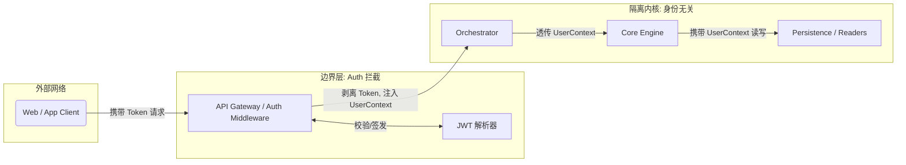
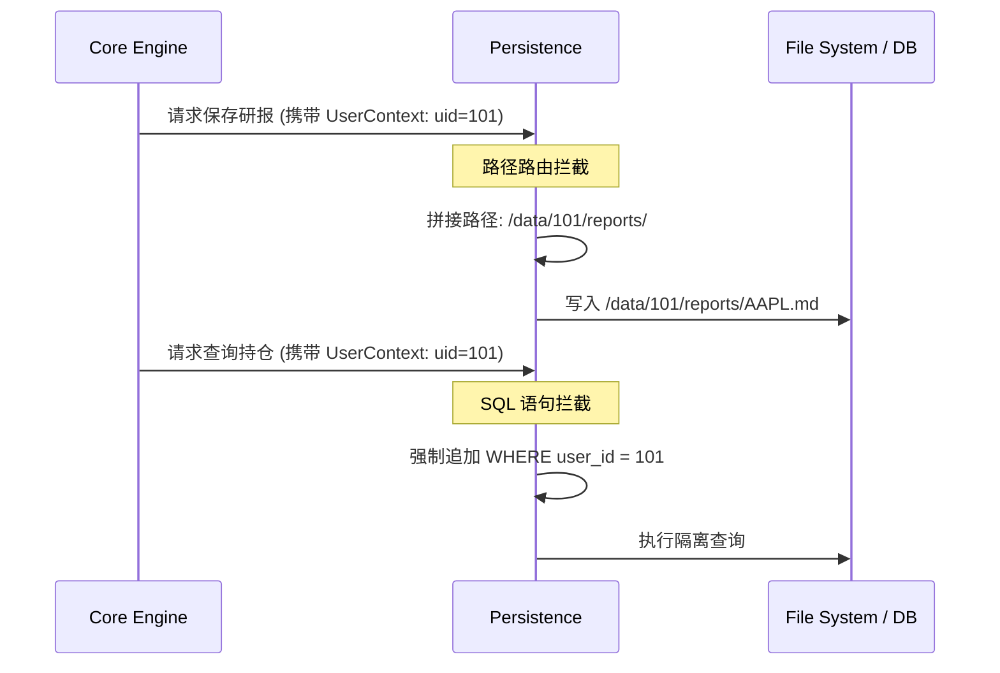

# 🔐 Multi-User & Auth - 权限管理模块详细设计

| 🏷️ 属性 | 📄 内容 |
| :--- | :--- |
| **模块编号** | 5.0 |
| **状态** | 🟢 详细设计完成 (Ready for Implementation) |
| **核心范式** | Identity-Agnostic Core (身份无关内核) |

## 1. 模块综述 (Overview)

本模块负责在多用户/云端部署场景下，确保身份的安全认证与数据的严格隔离。

## 2. 身份无关内核模式 (The Identity-Agnostic Core Pattern)

## 3. 认证与授权 (AuthN & AuthZ)

### 3.1 基于角色的访问控制 (RBAC Transition State)

| 用户角色 (Role) | 发现子域权限 | 决策子域权限 (Debate) | 管理子域权限 | 并发/负载限制 |
| :--- | :--- | :--- | :--- | :--- |
| **BASIC** | 基础行业推演 | 标准双主体博弈 | 基础盈亏追踪 | 单一串行任务 |
| **PRO** | 深度产业链扫描 | 多维度/多空红队博弈 | 全局风险敏感度诊断 | 允许并行调度 |
| **ADMIN** | 全部开放 | 全部开放 | 全部开放 + 系统监控 | 无限制 |

## 4. 数据隔离机制 (Data Isolation Mechanism)

系统核心绝不跨租户读取数据。隔离机制不仅体现在文件系统，还体现在数据库查询层面。

