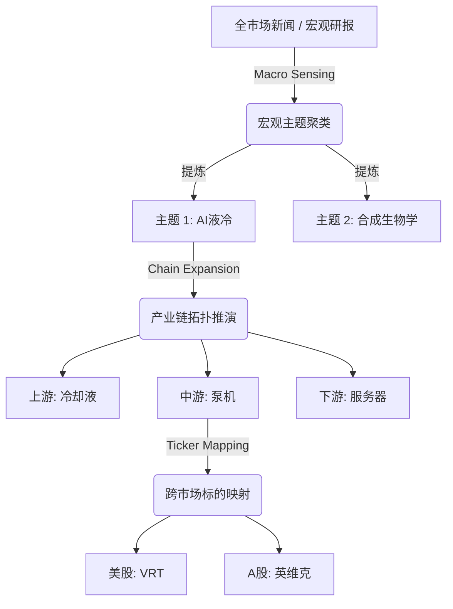
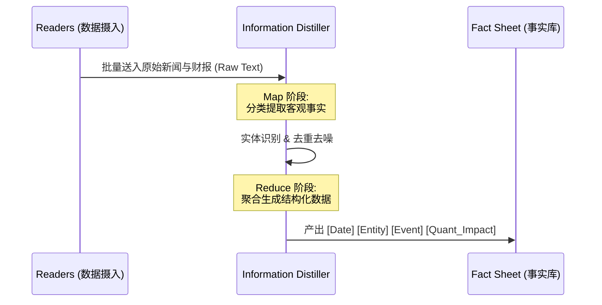
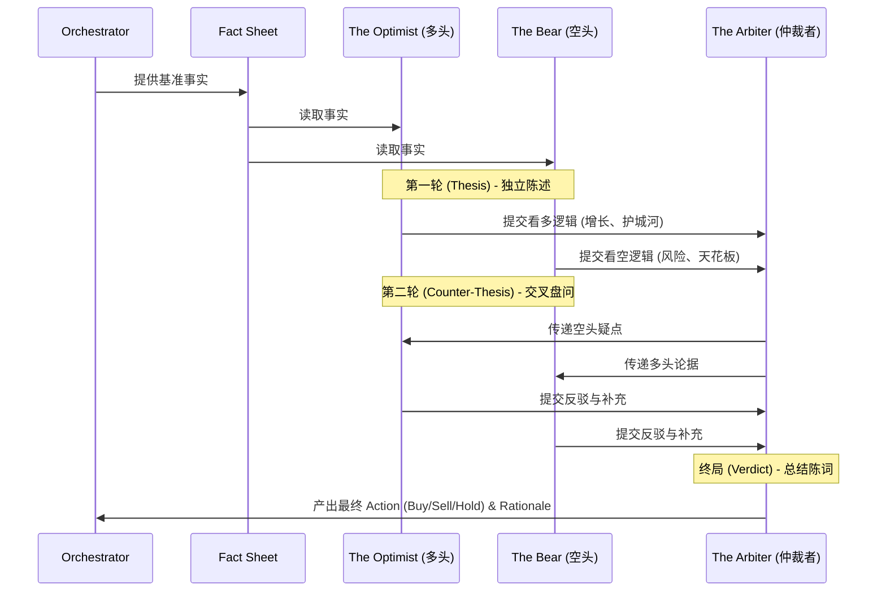

# 🧠 Core Engine - 核心推理引擎详细设计

| 🏷️ 属性 | 📄 内容 |
| :--- | :--- |
| **模块编号** | 4.4 |
| **状态** | 🟢 详细设计完成 (Ready for Implementation) |
| **核心范式** | 子域驱动设计 (Sub-domain Driven) + 多智能体博弈 |

## 1. 模块综述 (Overview)

Core Engine 是 Titan-Lite 的智力中枢。它不直接负责取数，而是对 Orchestrator 传递过来的“事实清单 (Fact Sheet)”进行深度的逻辑加工。它由四个高度自治的子域组成，分别对应投资的不同阶段。

## 2. 发现子域 (Discovery Domain - ConceptMiner)

负责执行 Top-Down 的动态标的发现，替代传统的静态股票池。

### 2.1 概念发现流 (Top-Down Discovery Flow)

## 3. 评估子域 (Analytical Domain)

负责将海量、碎片化的信息提炼为“纯净”的投研素材。

### 3.1 信息提纯管道 (Information Distillation Pipeline)

*   **痛点**：长文本上下文容易导致 LLM “迷失”，且 API 成本极高。
*   **设计**：采用 **"Map-Reduce"** 模式。先将新闻碎片分类提取出“客观事实项”，过滤掉情绪化的形容词和重复内容，生成一份 **Fact Sheet**。

## 4. 决策子域 (Decision Domain - Multi-Agent Debate)

基于 Fact Sheet，启动多维度认知的对撞。

### 4.1 多智能体博弈流 (Multi-Agent Debate Flow)

## 5. 管理子域 (Management Domain)

负责现有组合的“健康监护”。不仅仅看盈亏，更看**“逻辑暴露”**。计算全组合对特定因子（如美债利率）的敏感度。

## 6. 与 Orchestrator 的集成

Core Engine 的每个功能都以 Action 的形式被 Orchestrator 调用，完全受事件驱动。
