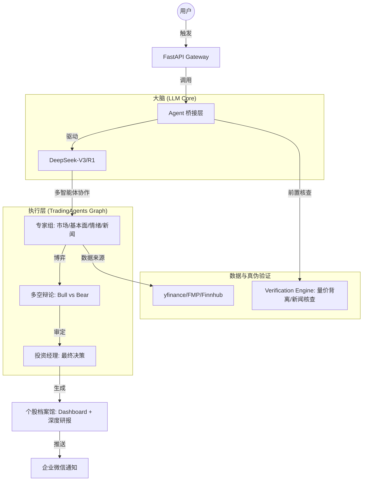

# 📊 Titan-Lite V3.0 架构设计文档

## 1. 系统愿景
Titan-Lite 是一个针对个人投资者设计的“机构级”量化研报与决策系统。通过 DeepSeek 强大的推理能力，驱动多智能体（Multi-Agent）协作，实现从数据抓取、事实核查到多空辩论的全自动化投资闭环。

## 2. 核心架构图

## 3. 关键组件说明

### 3.1 Agent Bridge (桥接层)
- **职责**：将 Titan-Lite 业务逻辑与底层 `TradingAgents` 框架链接。
- **特性**：
  - 自动注入 DeepSeek 密钥与环境变量。
  - 实时日志流：通过 `ConsoleStreamHandler` 监控 Agent 思考过程。
  - 故障降级：当多智能体配额耗尽时，自动切换至 `Solo Agent`（单兵模式）。

### 3.2 Verification Engine (鉴伪引擎)
- **AI 事实核查**：利用 LLM 对最新新闻流进行真实性评分。
- **量价背离监控**：计算 OBV 指标，验证价格上涨是否有资金流支撑。
- **高管行为分析**：监控 Insider Trading 信号，识别大股东减持风险。

### 3.3 个股档案馆 (Symbol Archive V3.0)
- **Hierarchical Storage**：按股票代码建立文件夹，存储带日期的时间戳研报。
- **Symbol Dashboard**：动态生成个股总览页，包含：
  - **指标演变表**：追踪最近 5 次调研的基本面变动。
  - **三段论总结**：历史回顾、当前状态、未来预期。

## 4. 技术栈
- **语言**：Python 3.12
- **核心框架**：LangGraph, LangChain
- **模型**：DeepSeek (OpenAI 兼容接口)
- **Web**：FastAPI + VitePress
- **数据**：yfinance, FMP, Finnhub, Stockstats

## 5. 开发路线图
- [x] **Phase 1**: 基础架构搭建与 DeepSeek 迁移
- [x] **Phase 2**: 个股档案馆与 Dashboard 自动生成
- [ ] **Phase 3**: 对比 Agent 开发（跨日期研报自动比对分析）
- [ ] **Phase 4**: 移动端 Webhook 深度交互

---
*Last Updated: 2026-05-10 | Titan-Lite Core Team*
