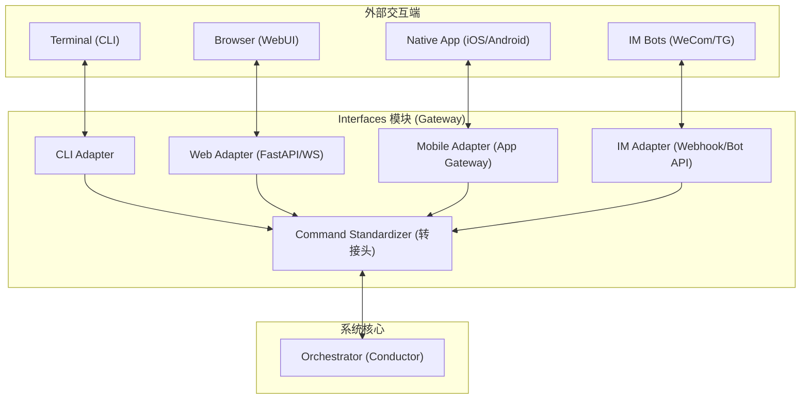

# 🚪 Interfaces - 通信边界模块详细设计 (Hardened v3.3)

| 🏷️ 属性 | 📄 内容 |
| :--- | :--- |
| **模块编号** | 4.1 |
| **版本** | v3.3 |
| **状态** | 🟢 详细设计完成 (集成非阻塞 API 契约 & 插件化适配器) |

## 1. 模块综述 (Overview)

Interfaces 模块作为 Titan-Lite 的“外部感知层”，负责解耦各种前端交互方式（CLI, WebUI, Mobile App, IM Bots）与后端 Orchestrator 核心逻辑。

该模块采用 **插件化适配器架构**，确保系统能够无缝扩展至未来的移动原生应用及主流即时通讯平台（如企业微信、Telegram）。同时遵循 **非阻塞交互原则**：对于长耗时任务，必须立即返回 `job_id`，实现非阻塞交互。

## 2. 核心架构：多端适配器方案 (Multi-Frontend Adapter)



---

## 3. Interfaces 入站非阻塞 API 契约 (FastAPI Spec)

以下为 Interfaces（基于 FastAPI 范式）与 Orchestrator 之间的标准契约接口，确保长耗时任务的异步化。

### 3.1 提交研报任务 (入站异步触发)
*   **HTTP Method**: `POST`
*   **Path**: `/api/v1/research/submit`
*   **Request Body**:
    ```json
    {
      "ticker": "TSLA",
      "workflow_template": "DEEP_DIVE_v1"
    }
    ```
*   **Response (立即返回 - HTTP 202 Accepted)**:
    ```json
    {
      "job_id": "job_20260601_abcd1234",
      "status": "INIT",
      "message": "投研流水线已成功触发，正在进行静态拓扑核验。",
      "estimated_seconds": 180
    }
    ```

### 3.2 任务状态轮询接口
*   **HTTP Method**: `GET`
*   **Path**: `/api/v1/research/status/{job_id}`
*   **Response Body**:
    ```json
    {
      "job_id": "job_20260601_abcd1234",
      "ticker": "TSLA",
      "status": "ANALYZING", 
      "current_step": "step3",
      "active_actions": ["MULTI_AGENT_DEBATE"],
      "progress_percentage": 66.7,
      "errors": [],
      "updated_at": "2026-06-01T08:35:00Z"
    }
    ```

---

## 4. 各端适配器详细定义 (Adapter Specifications)

### 4.1 CLI Adapter (命令行适配器)
*   **职责**：处理终端输入，解析 Python `argparse/click` 参数。
*   **特性**：使用 `rich` 渲染动态进度条，支持本地交互式调试。

### 4.2 Web Adapter (Web/REST/WS 适配器)
*   **职责**：面向 Web 控制台。
*   **通信**：FastAPI 提供上述 REST 接口，同时建立 **WebSocket** 同步推送 `PROGRESS_UPDATE` 事件，实时更新 `FundManager.vue` 状态。

### 4.3 Mobile Adapter (移动端应用适配器 - 预留)
*   **定位**：为未来的 iOS/Android 原生 App 提供后端支撑。
*   **特性**：
    *   **消息压缩**：采用 Protobuf 或精简 JSON 降低流量消耗。
    *   **持久连接管理**：针对移动端后台挂起状态提供心跳及自动重连逻辑。

### 4.4 IM Adapter (即时通讯机器人适配器)
*   **集成对象**：企业微信 (WeCom)、Telegram、Lark (飞书)。
*   **核心功能**：
    *   **入站指令**：通过 Webhook 接收 IM 指令（如发送 `/analyze AAPL` 触发研判）。
    *   **异步推送 (Outbound)**：
        *   **任务通知**：任务开始/失败的实时告警。
        *   **研报投递**：任务完成后，自动将生成的 Markdown/PDF 研报推送至用户 IM 私聊或群组。
    *   **交互式卡片**：在企业微信等平台使用“交互卡片”确认 AI 辩论的中间决策。

---

## 5. 内部交互协议 (Internal Protocol)

### 5.1 标准请求模型 (Standard Request)
```python
class InternalCommand(BaseModel):
    user_context: UserContext
    task_id: str
    params: Dict[str, Any]
    priority: int = 1
    source_adapter: str  # ['cli', 'web', 'mobile', 'im']
```

### 5.2 消息分发契约 (Outbound Delivery)
Interfaces 监听 Orchestrator 的 `JOB_COMPLETED` 事件，并根据用户配置的推送策略执行分发：
*   **Rule A**: 如果 `source == 'cli'`, 则直接在终端输出结果。
*   **Rule B**: 如果用户开启了 IM 推送, 则调用 `IM_Adapter.send_file(user_id, report_path)`。

---

## 6. 安全与流控 (Security & Traffic Control)

*   **身份校验 (AuthN)**：Web/App 强制 JWT 校验；CLI 支持本地配置；IM 校验 Webhook 签名。
*   **速率限制 (Rate Limiting)**：基于 `user_id` 进行 Job 提交限流，防止 API 资源过载。
*   **状态同步**：针对 IM 平台引入指数退避重试机制，防止推送频率限制。
