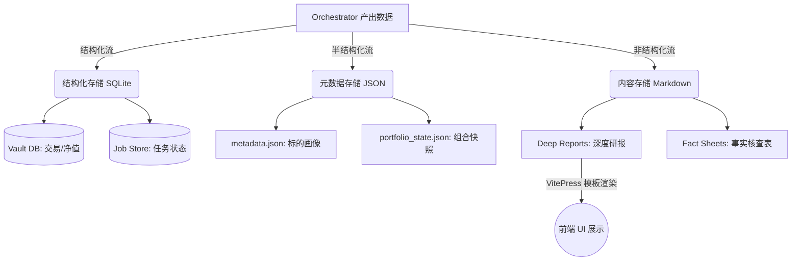
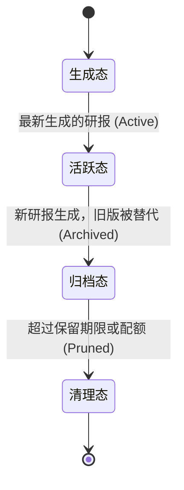

# 💾 Persistence - 内部资产持久化模块详细设计

| 🏷️ 属性 | 📄 内容 |
| :--- | :--- |
| **模块编号** | 4.5 |
| **状态** | 🟢 详细设计完成 (Ready for Implementation) |
| **核心范式** | Artifacts-as-Assets (资产化管理) |

## 1. 模块综述 (Overview)

Persistence 模块负责将 Orchestrator 产生的推理结论和状态转化为持久化的数字资产。它不涉及网络通信，只负责本地文件系统或数据库的读写。

## 2. 资产生命周期与存储流 (Asset Lifecycle & Storage Flow)

## 3. 存储分层与格式设计

### 3.1 结构化存储 (SQLite)
*   **Portfolio Vault** (`vault.db`)：存储交易记录、账户余额、净值历史。
*   **Job Store**：存储 Orchestrator 的任务状态与 Actions 中间结果（用于断点续跑）。

### 3.2 研报渲染引擎 (Markdown Engine)
Writers 层包含一个模板引擎，负责将复杂的多智能体辩论渲染为美观的 Markdown，并自动注入 Vue 组件（如 `<ReportArtifacts />`, `<BacktestChart />`）。

## 4. 生命周期管理与垃圾回收 (Version Control & GC)

*   **版本控制**：同一标的多次研判通过时间戳区分（`AAPL_2026-06-01.md`）。
*   **垃圾回收 (GC)**：定期运行的守护进程，按配置保留最近 N 份研报，释放磁盘空间。

## 5. 数据隔离规则 (Multi-tenancy Ready)
所有写操作强制受限于 `UserContext`，确保路径隔离：`/data/storage/{user_id}/{asset_type}/...`
