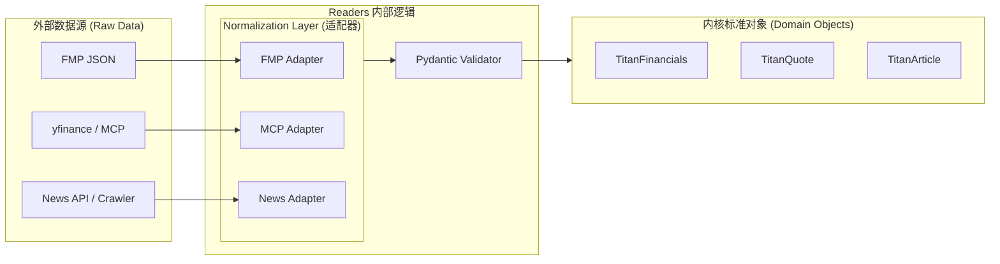

# 📥 Readers - 数据摄入模块详细设计 (Hardened v3.0)

| 🏷️ 属性 | 📄 内容 |
| :--- | :--- |
| **模块编号** | 4.2 |
| **版本** | v3.0 |
| **状态** | 🟢 详细设计完成 |

## 1. 模块综述 (Overview)

Readers 是系统的“信息触手”。其职责不仅是跨越异构 API (MCP, FMP, yfinance, News) 获取原始数据，更重要的是通过 **Normalization Layer (标准化层)** 将这些“脏数据”转换为系统内核唯一认知的 **Domain Objects (领域对象)**。

这种设计确保了 Orchestrator 与具体数据供应商（Provider）完全解耦：无论底层是付费的 FMP 还是开源的 yfinance，内核接收到的数据结构始终如一。

## 2. 核心架构：标准化适配器模式



---

## 3. 领域对象定义 (Domain Objects Contract)

所有 Reader 必须返回以下定义的标准模型（基于 Pydantic）：

### 3.1 核心财务数据 (TitanFinancials)
用于计算估值、成长性及健康度。
```python
class TitanFinancials(BaseModel):
    symbol: str
    period: str                     # 'FY2023', 'Q3_2024'
    revenue: float                  # 营业收入 (统一为 USD 或基准币种)
    net_income: float               # 净利润
    eps: Optional[float]            # 每股收益
    free_cash_flow: Optional[float] # 自由现金流
    metadata: Dict[str, Any] = {
        "source": "FMP",            # 溯源标签
        "is_audited": True,         # 是否经审计
        "timestamp": 1717320000     # 采集时间戳
    }
```

### 3.2 市场实时快照 (TitanQuote)
用于实时监控与信号触发。
```python
class TitanQuote(BaseModel):
    symbol: str
    price: float
    change_pct: float
    volume: int
    market_cap: float
    last_updated: datetime
```

### 3.3 资讯与情绪对象 (TitanArticle)
为 AI 推理引擎提供标准化语料。
```python
class TitanArticle(BaseModel):
    id: str
    title: str
    content: str                    # 纯净文本内容 (已剥离 HTML)
    published_at: datetime
    url: str
    sentiment_score: float = 0.0    # 预处理的情绪分 (-1.0 to 1.0)
    entities: List[str] = []        # 提及的股票/公司实体
```

---

## 4. 标准化层逻辑 (Normalization Logic)

### 4.1 数据清洗流程 (The Pipeline)
1.  **Extract (提取)**: 从 Provider 获取原始 JSON。
2.  **Mapping (映射)**: 
    *   *字段重命名*: 例如将 FMP 的 `netIncome` 和 yfinance 的 `Net Income` 统一映射为 `net_income`。
    *   *单位换算*: 将所有货币单位统一（如将百万、十亿单位展开为完整数值）。
3.  **Filling (对齐)**: 
    *   如果 Primary 源缺失 `free_cash_flow`，Adapter 会触发 Fallback 源补全。
4.  **Validation (校验)**: 
    *   使用 Pydantic 进行类型强制转换。
    *   逻辑自洽校验（例如：`Net Income` 不应持续大于 `Revenue`）。

### 4.2 适配器代码示例
```python
class FMPFinancialAdapter:
    def to_domain(self, raw_json: dict) -> TitanFinancials:
        return TitanFinancials(
            symbol=raw_json["symbol"],
            period=f"{raw_json['calendarYear']}_{raw_json['period']}",
            revenue=raw_json["revenue"],
            net_income=raw_json["netIncome"],
            # 自动处理 FMP 与系统标准的差异
            metadata={"source": "FMP", "raw_id": raw_json.get("cik")}
        )
```

---

## 5. 智能降级与熔断机制 (Reliability)

### 5.1 三态熔断器 (Circuit Breaker)
*   **Closed**: 正常请求 Primary (FMP)。
*   **Open**: 1 分钟内 429/5xx 错误 > 5 次，立即熔断 300 秒。期间所有请求直接路由至 Secondary (MCP)。
*   **Half-Open**: 熔断结束后，尝试 1 笔请求。成功则恢复，失败则重新熔断。

### 5.2 自动降级路径 (Tiered Fallback)
1.  **Tier 1 (Cache)**: 检查 Redis/SQLite 是否有未过期的 Domain Object。
2.  **Tier 2 (Primary)**: 请求机构级 API (FMP)。
3.  **Tier 3 (Secondary)**: 调度 MCP Server (yfinance/AlphaVantage)。
4.  **Tier 4 (Stale)**: 如果全部失效，返回带有 `is_stale=True` 标记的过期缓存数据。

## 6. 缓存策略 (Caching Layer)

*   **Financials**: 24h 缓存 (存储标准化后的 `TitanFinancials` 对象)。
*   **Quotes**: 不缓存 (实时透传)。
*   **News**: 1h 缓存 (避免 AI 重复处理相同资讯)。
