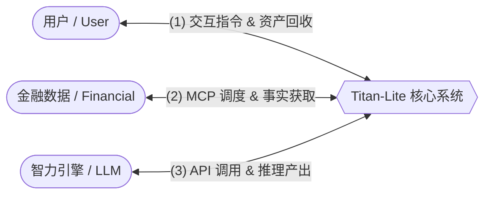
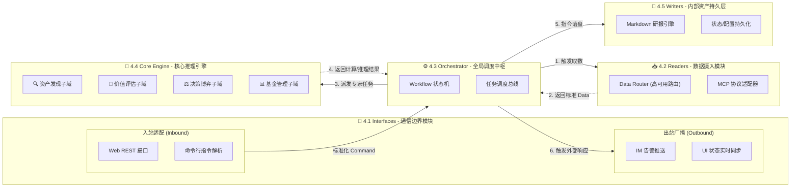

# 🏗️ Titan-Lite 核心系统架构与设计总纲

| 🏷️ 属性 | 📄 内容 |
| :--- | :--- |
| **作者** | Darranlio |
| **撰写日期** | 2026-05-30 |
| **归档状态** | 🟢 已发布 (Active Design) |

## 1. 背景与意义 (Background & Significance)

在当前的资本市场中，个人投资者与专业量化机构之间存在着深刻的信息与算力不对称。

**机构的优势与劣势：**
*   **优势**：拥有庞大的数据中台、昂贵的底层数据源，以及由顶尖数学家和分析师组成的投研团队。他们在获取信息的**广度**、处理高频数据的**速度**以及挖掘微小套利空间上具有压倒性优势。
*   **劣势**：受限于严格的风控合规、资金体量庞大导致的建仓/出货困难（流动性冲击成本），以及基金经理为了短期业绩排名而产生的“羊群效应”。机构往往难以在早期耐心布局具有长远爆发力的“非共识”资产。

**个人投资者的优势与劣势：**
*   **劣势**：信息来源碎片化、存在严重的时间与精力瓶颈、容易受市场噪音和主观情绪裹挟，普遍缺乏纪律性和深度财务/商业模式拆解能力。
*   **优势**：资金体量小，进出灵活（无市场冲击成本）；没有短期业绩考核压力，可以真正做**长期的时间做朋友（价值投资）**；可以在机构受限或暂时忽视的细分领域进行左侧潜伏。

**Titan-Lite 的定位与价值：**
Titan-Lite 的核心逻辑是帮助个人投资者**扬长避短**。它不去试图模仿机构的高频量化扫描或因子挖掘能力，而是作为个人的“超级数字投研中枢”，补齐个人在**信息获取效率**和**深度逻辑解析**上的短板。通过系统化的宏观推演、事实核查和多空辩论，Titan-Lite 帮助个人建立极度理性的决策护城河，从而充分发挥其资金灵活、着眼长期的绝对优势。

## 2. 目标与非目标 (Goals & Non-Goals)

**🎯 目标 (Goals)：**
*   **深度的价值投资辅助**：专注于对特定产业链或单个标地进行深度、逻辑严密的价值挖掘与健康度体检，为长期持有提供坚实的逻辑与信心支撑。
*   **纪律化的组合管理**：提供净值追踪、仓位管理和资产配置诊断，帮助个人以机构级的心态和纪律管理财富。
*   **沉淀投研知识资产**：将每一次决策的逻辑、事实数据和宏观背景固化为标准的结构化文档，形成个人专属的、可复盘的数字档案馆。

**🚫 非目标 (Non-Goals) - 必须坚守的纪律雷区：**
*   **不支持自动交易执行**：Titan-Lite 只负责生成信号和逻辑，**绝对不**直接对接券商 API 进行自动化下单。最终的拍板权和资金风险必须由人类承担。
*   **不支持高频/短线交易**：分析框架基于基本面和中长期商业价值，不适用也不支持任何基于日内动量、技术形态等高频指标的短线博弈。
*   **不支持无差别全量扫描**：受限于算力和接口成本，系统不追求每日“地毯式”扫遍全市场。它的发力点在于基于“宏观产业链推演”的精确制导发现。

## 3. 系统架构 (System Architecture) - 1000ft View

Titan-Lite 是一个以本地服务为核心，通过标准化接口与外部世界交互的轻量级中枢神经系统。系统的宏观交互由以下四个核心模块构成：

**核心交互对象与方式详述：**

1.  **用户 (User)**：投资者通过 App、WebUI 或 CLI 终端向系统下达研究指令（如深度研判、产业链推演）。任务执行过程中，用户可实时监控进度；任务完成后，系统将生成的数字资产（Markdown研报、交易指令、估值模型）推送到用户端。
2.  **金融数据源 (Financial)**：系统通过统一的 MCP (Model Context Protocol) 调度第三方金融信息机构（如 yfinance, FMP, Finnhub）的 API。此模块负责摄入实时的量价行情、静态的财务报表、以及海量的实时新闻与舆情流。
3.  **智力引擎 (LLM Model)**：系统通过 API 与大语言模型服务商（如 DeepSeek, Claude, Gemini）进行深度交互。核心系统将清洗后的事实清单封装为 Prompt，驱动 LLM 进行逻辑推理、多空辩论并产出最终的投研结论。
4.  **Titan-Lite (系统核心)**：作为交互的中枢，负责协调上述三方的流量与逻辑。它不仅是指令的执行者，更是原始数据与高阶智慧之间的联结器。

## 4. Titan-Lite 软件架构 (Software Architecture)

基于 **六边形架构 (Hexagonal Architecture)** 和 **ROW (Reader-Orchestrator-Writer) 模式**，本系统实现了“核心业务与外部通信”的深度解耦。软件按功能划分为以下五个核心模块：

### 4.1 Interfaces - 用户交互与通信边界模块
*   **职责**：作为系统的“视听器官”，它是 Titan-Lite 与外界互动的唯一双向通道，负责将外部异构协议隔离在业务逻辑之外。
    *   **Inbound (入站)**：负责监听来自 WebUI、App 或 CLI 终端的指令。对于长耗时任务，**必须立即返回 `job_id`**，实现非阻塞交互。
    *   **Outbound (出站)**：负责向外部世界广播执行状态与警报。通过 **WebSocket** 实时推送 Orchestrator 的状态机变更，实现进度条的平滑同步。
*   **🚫 禁忌**：绝不包含任何业务校验、投资逻辑或数据计算。**严禁采用同步阻塞方式等待长耗时投研任务**。

### 4.2 Readers - 数据接入与感知模块
*   **职责**：作为系统的“信息触手”，纯粹负责外部数据的拉取与清洗。
    *   **高可用机制**：实现 Data Gateway 路由，在 MCP、Alpha Vantage、yfinance 等多源之间进行限流降级与主备切换。
    *   **转换逻辑**：将原始 JSON/HTML 脏数据转化为 Orchestrator 可理解的统一数据对象（Domain Objects）。
*   **🚫 禁忌**：绝不包含任何诸如“市盈率过高则过滤”的业务判断逻辑。

### 4.3 Orchestrator - 全局调度与管控中枢
*   **职责**：**系统的总指挥 (Conductor)**。它是横向贯穿所有层级的“控制面”，维护整个投研流水线的状态流转。
    *   **异步状态机**：系统被设计为一个**完全异步的事件驱动状态机 (Async State Machine)**。负责管理 Job 队列，维护从 `INIT` -> `FETCHING` -> `ANALYZING` -> `DONE` 的状态切换。
    *   **并发调度**：利用 `asyncio` 异步调度 Readers 取数与 Engines 计算，确保系统的高吞吐量与低延迟响应。
*   **🚫 禁忌**：**它本身不产生任何认知，不进行任何数学计算。** 严禁出现任何会阻塞事件循环 (Event Loop) 的同步调用。

### 4.4 Core Engine - 核心业务推理引擎 (LLM 交互中枢)
*   **职责**：系统真正的“业务大脑”。包含所有核心算法与大模型（LLM）推理逻辑。它被划分为四个高度内聚的子域：
    1.  **Discovery (发现子域)**：执行 Top-Down 产业链推演与标的映射，解决“看什么”的问题。
    2.  **Analytical (评估子域)**：
        *   **Information Distiller (信息提纯器)**：针对海量新闻舆情进行“预提炼”。利用低成本模型提取事实实体，过滤冗余噪音，生成精简的 **Fact Sheet**，彻底解决“上下文迷失”与 API 成本问题。
        *   **Institutional Skills**：集成 DCF 现金流贴现建模、Comps 可比公司分析等专业 Skill。
    3.  **Decision (决策子域)**：基于提炼后的 Fact Sheet 进行多智能体博弈（Multi-Agent Debate）产出最终买卖结论。
    4.  **Management (管理子域)**：负责个人基金的净值核算、仓位追踪及**AI 驱动的组合健康度诊断**。
*   **🚫 禁忌**：**严禁将未经提纯的原始海量长文本直接喂给高成本大模型（如 Claude/Gemini）**。

### 4.5 Writers / Repositories - 内部资产持久化模块
*   **职责**：作为系统的“档案管理员”。专门负责终端软件内部的数字资产组织与持久化管理。
    *   **资产固化**：将 Orchestrator 传递的决策结论渲染为标准的 Markdown 研报树，或序列化为 JSON 核心状态集。
*   **🚫 禁忌**：绝不与外部网络发生任何通信（如发送邮件或微信）。

## 5. 多用户与权限系统 (Multi-User & RBAC)

为了支持云端多租户部署，系统必须实现严格的用户识别与数据隔离。设计遵循 **“内核单用户，外壳多租户”** 的桥接原则，确保系统既能保持轻量化本地运行，又能无缝扩展至云端。

### 5.1 身份无关内核 (Identity-Agnostic Core)
*   **核心逻辑**：Titan-Lite 核心引擎（Orchestrator & Engines）本身不感知 JWT 或数据库用户表。它仅认标准化的 `UserContext`。
*   **桥接设计**：
    *   **本地模式**：外壳适配器直接填充 `default_user` 身份。
    *   **云端模式**：`Interfaces` 边缘层负责 AuthN（JWT 校验）并动态生成 `UserContext` 注入指令流。

### 5.2 身份认证与访问控制 (AuthN & AuthZ)
*   **接口层 (Interfaces)**：实现基于 **JWT (JSON Web Token)** 的身份认证。所有进入系统的指令必须携带合法的 `access_token`。接口层负责验证身份 (AuthN) 并解析用户角色 (Role)。
*   **控制面 (Orchestrator)**：负责鉴权 (AuthZ)。根据用户角色判断其是否有权执行特定任务（如：普通用户只能研判标的，管理员可查看系统负载）。

### 5.3 身份上下文透传 (User Context Propagation)
*   所有内部 `Command` 对象必须封装一个 `UserContext` 结构体。该上下文贯穿整个投研流水线，确保 AI 逻辑、数据查询均针对该特定用户执行（如：仅查询该用户的自选股数据）。

### 5.4 数据多租户隔离 (Data Isolation)
*   **物理隔离**：`Persistence` 层在落盘资产时，强制使用 `user_id` 作为存储根路径（如：`/data/storage/{user_id}/reports/AAPL.md`）。
*   **逻辑隔离**：`Readers` 在请求缓存数据或用户配置时，必须以 `user_id` 为唯一键值。

## 6. 模块详细设计与开发计划

### 6.1 模块详细设计矩阵 (Module Design Matrix)

| 模块名称 | 详细设计文档 | 状态 |
| :--- | :--- | :--- |
| **4.1 Interfaces - 通信边界模块** | [详细设计文档](./interfaces_design.md) | 🟢 设计完成  |
| **4.2 Readers - 数据接入模块** | [详细设计文档](./readers_design.md) | 🟢 设计完成 |
| **4.3 Orchestrator - 全局调度中枢** | [详细设计文档](./orchestrator_design.md) | 🟢 设计完成  |
| **4.4 Core Engine - 核心推理引擎** | [详细设计文档](./core_engine_design.md) | 🟢 详细设计完成 |
| **4.5 Writers - 内部资产持久化模块** | [详细设计文档](./persistence_design.md) | 🟢 详细设计完成 |
| **5.0 Multi-User - 权限管理模块** | [详细设计文档](./auth_design.md) | 🟢 详细设计完成 |

### 6.2 迭代开发计划总纲 (Development Meta-Plan)

本计划定义了系统重构的关键阶段。具体的编码与模块自测任务将下沉至各子模块的详细设计文档中。

| 阶段 | 目标 (Goal) | 核心任务 (Key Tasks) | 验收标准 (Verification) |
| :--- | :--- | :--- | :--- |
| **Step 1: 模块设计深化** | 完善 5+1 个核心模块子文档 | 在子文档中定义物理结构、类图、逻辑及自测用例 | 所有 `*_design.md` 文件内容填充率达到 100% |
| **Step 2: 交互协议定义** | 确立跨边界通信标准协议 | 1. 协议选型 (Protobuf vs JSON/Pydantic) 2. 明确层级间接口契约 (Interface Contracts) | 形成统一的数据 Schema 定义文件 |
| **Step 3: 多用户支持** | 实现身份认证与数据隔离 | 1. JWT 鉴权中间件开发 2. 存储路径租户化改造 | 模拟 A 用户无法读取 B 用户研报的隔离测试通过 |
| **Step 4: 整体功能验收** | 完成全链路集成测试 | 1. 端到端闭环流程校验 2. 架构合规性审计 (无跨层违规调用) | 模拟多用户并发任务，闭环运行无报错 |

## 7. 附录：术语表 (Glossaries)

*   **Hexagonal Architecture (六边形架构 / 端口与适配器)**: 本系统的终极架构范式。强调将核心业务逻辑完全隔离在中心，外部的触发接口（Interfaces）和依赖统统作为“端口和适配器”接入，实现极高扩展性。
*   **Control Plane vs. Data Plane (控制面与数据面分离)**: Orchestrator 是控制面，作为交通枢纽负责横向调度各个模块流转；Core Engines 是数据面，负责独立执行深度的业务计算。
*   **Data Gateway Routing (数据网关路由)**: 在 Readers 层实现的主备机制。当首选数据源（如 MCP）限流或失败时，自动无缝降级到备用数据源（如 yfinance），保障工业级系统高可用性。
*   **Top-Down Mining (自上而下挖掘)**: 系统的寻找标的机制。先看宏观环境，推演具体的产业链条和受益节点，最后利用数据源进行跨境标的映射，取代硬编码股票池。
*   **Multi-Agent Debate (多智能体辩论)**: 位于 Domain 层的核心逻辑。设定不同人设的 AI Agent 针对同一事实清单进行逻辑对抗，挤出单向认知泡沫。
*   **Fact Sheet (事实核查清单)**: 强制生成的一份只包含客观数据的报表，作为大模型不可篡改的“思考锚点”，大幅降低 AI 幻觉。
