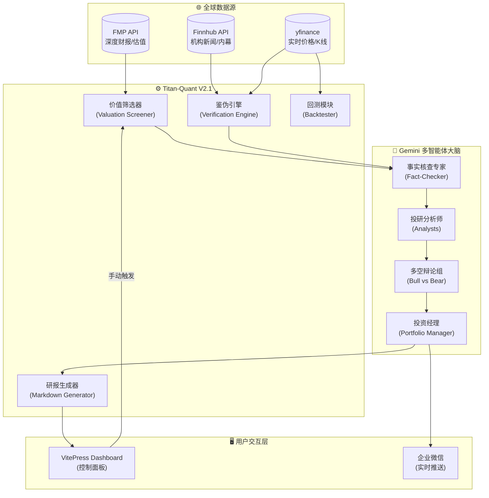

# 🏗️ Titan-Lite 系统架构设计文档

::: info 文档元数据
- **版本**: v1.0.0
- **状态**: 🟢 已归档 (Stable)
- **维护者**: Darranlio
- **最后更新**: 2026-01-11
:::

## 1. 背景与价值分析 (Background & Value)

### 1.1 项目背景
在当前的 A 股市场环境中，散户投资者面临着信息不对称、情绪化交易和工具匮乏三大痛点。传统的看盘软件无法提供基于**统计套利 (Statistical Arbitrage)** 的深度分析，且市面上的量化系统大多庞大臃肿，不适合个人开发者在低成本云服务器上部署。

### 1.2 核心价值
**Titan-Lite** 旨在构建一个**轻量级、低延迟、基于数学模型**的辅助决策系统。

* **客观性 (Objective)**: 用卡尔曼滤波 (Kalman Filter) 替代均线，用 Z-Score 替代直觉，通过数学消除情绪干扰。
* **低成本 (Low Cost)**: 针对 2C/2G 低配云服务器优化，采用 Docker 容器化部署，运维成本极低。
* **自动化 (Automation)**: 从数据清洗、策略计算到信号推送，实现全流程无人值守。

---

## 2. 目标与非目标 (Goals & Non-Goals)

### ✅ 核心目标 (Goals)
1.  **配对交易挖掘**: 每日自动扫描全市场，基于协整性 (Cointegration) 挖掘具有长期稳定价差关系的股票对 (CP)。
2.  **动态风控**: 结合宏观指数波动率进行熔断，结合 AI 舆情分析过滤垃圾信号。
3.  **双轨推送**: 实现“交易员视角” (操作指令) 和“观察者视角” (学术图表) 的差异化推送。
4.  **资源适应性**: 必须在 2GB 内存环境下稳定运行，具备内存逃逸 (OOM) 保护机制。

### ❌ 非目标 (Non-Goals)
1.  **高频交易 (HFT)**: 不追求毫秒级速度，系统定位为日线/小时线级别的波段策略。
2.  **全自动下单**: 仅提供决策信号，不直接对接券商接口进行实盘下单（出于合规与安全考虑）。
3.  **即时大屏**: 不开发复杂的动态 Web Dashboard，使用静态 Wiki 和 IM 推送作为主要交互界面。

---

## 3. 系统总体架构 (System Architecture V2.1)

系统已升级为**机构级多源验证架构**。

---

## 4. 核心功能特性

### 4.1 机构级价值漏斗
不同于传统的形态选股，Titan-Lite 关注**估值偏离度**。
1. **获取 FMP 共识目标价**：提取华尔街顶级投行的平均预期。
2. **计算 Upside**：筛选出上涨空间 > 10% 的标的。
3. **基本面审计**：自动检查 PE/ROE 等核心指标。

### 4.2 🛡️ 事实核查与鉴伪 (Verification)
为了防止“小报割韭菜”，系统引入了三重鉴伪：
* **AI 交叉审计**：比对多源新闻，识别诱多话术。
* **量价背离监控**：通过 OBV 指标监测是否属于“缩量诱多”。
* **内幕交易对冲**：若利好发布时高管在抛售，系统将强制下调真实性评分。

### 4.2 数学模型层 (Math Engine)
采用**动态对冲比率**计算模型，而非传统的静态回归。

**核心算法：卡尔曼滤波 (Kalman Filter)**

状态方程定义如下：
$$
\beta_t = \beta_{t-1} + \omega_t, \quad \omega_t \sim N(0, Q)
$$

观测方程：
$$
Price_A = \beta_t \cdot Price_B + \alpha_t + \epsilon_t
$$

其中 $\beta_t$ 为动态对冲比率，随时间自适应调整，能更快捕捉市场结构变化。

### 4.3 策略执行层 (Strategy Executor)
策略流水线包含三个阶段：

1.  **宏观熔断 (Macro Guard)**:
    * 检测沪深 300 指数近 20 日波动率。
    * 若 `Vol > Threshold` 或 `Drawdown > 10%`，全系统暂停开仓。
2.  **信号生成 (Signal Gen)**:
    * 计算价差序列 (Spread)。
    * 计算 Z-Score:
    $$
    Z = \frac{Spread - \mu}{\sigma}
    $$
    * 触发阈值：$|Z| > 2.0$ (95% 置信区间)。
3.  **AI 过滤 (Fact Check)**:
    * 调用 DeepSeek API 对标的股进行舆情摘要。
    * Prompt 核心：*“请忽略短期波动，仅总结客观事实，判断是否存在基本面恶化。”*

### 4.4 可视化与推送 (Visualization & Delivery)
实现了 **ChartPainter** 绘图引擎，支持多模式输出：

| 模式 | 风格 | 用途 | 内容特征 |
| :--- | :--- | :--- | :--- |
| **Private** | 深色/高对比度 | 实盘操作 | 包含止损线、明确买卖指令 |
| **Public** | 白色/学术风 | 公众展示 | 包含水印、统计分布说明、免责声明 |

---

## 5. 基础设施与运维 (Infrastructure)

### 5.1 资源约束应对 (Resource Constraints)
鉴于 2GB 内存限制，系统采取了以下激进优化措施：

1.  **Swap 策略**: 开启 2GB Swap，并设置 `vm.swappiness=60`，允许将非活跃的 Python 对象积极换出到磁盘。
2.  **内存限制**: `package.json` 中限制 Node.js 构建内存 `--max-old-space-size=512`。
3.  **错峰运行**: 文档构建 (Build) 与量化计算 (Run) 通过时间表错开，避免 CPU 争抢。

### 5.2 CI/CD 流水线
采用 **Docs as Code** 理念，通过 Git 管理一切。

* **开发**: 本地 VS Code + Docker 环境。
* **部署**: GitHub Actions / SSH 脚本一键拉取并重建容器。
* **监控**: 基于 Docker Healthcheck 和 Python 内部的异常捕获推送。

---

## 6. 未来规划 (Roadmap)

- [ ] **Q1**: 引入 **Vector DB (向量数据库)**，构建本地知识库，让 AI 基于历史研报回答问题。
- [ ] **Q2**: 增加 **Backtest (回测) 模块**，在 Wiki 上展示策略的历史净值曲线。
- [ ] **Q3**: 开发 Webhook 接口，支持 TradingView 信号接入。