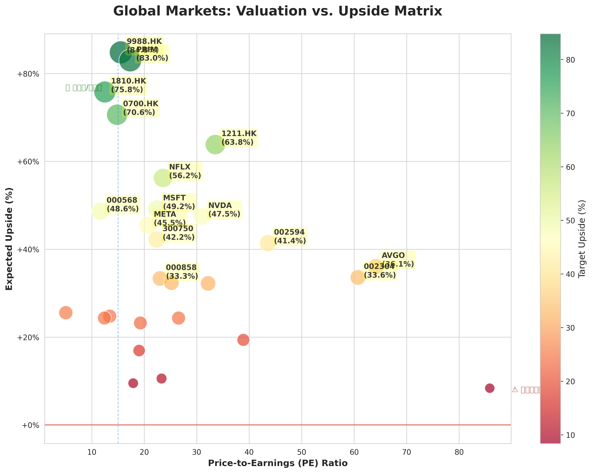

# 🌏 宏观全景研判 (2026-06-07_1840)

## 🎛️ 策略驾驶舱 (Cockpit)

::: list-card
| 行业热力图 | 潜力估值分布 |
| :---: | :---: |
| ⚠️ 热力图加载失败 |  |
:::

### 🚀 实时机会雷达 (Drill-down Hub)
| 核心胜出者 (点击直达个股深研) | 潜力候选池 (全市场初筛) |
| :--- | :--- |
| [000858](../reports/000858/index.md)(Underweight) | 000858... |

### 🗺️ 全景导航矩阵
| 🇨🇳 A股深研 | 🇺🇸 美股透视 | 🇭🇰 港股动态 | 📜 历史档案 |
| :---: | :---: | :---: | :---: |
| [查看 A股](../reports/index.md?market=CN) | [查看美股](../reports/index.md?market=US) | [查看港股](../reports/index.md?market=HK) | [历史总览](./macro/index.md) |

::: info 🕒 历史时间轴 (Timeline)
暂无历史记录
:::

---
::: info
**核心结论：全球宏观进入“通胀韧性+流动性拐点预期”阶段，风险等级维持7/10。** 核心逻辑：1）美债收益率曲线陡峭化反映出市场对经济软着陆与二次通胀的博弈；2）中概股受制于美元流动性紧缩与国内弱复苏，估值修复需等待更明确信号；3）AI链资金从硬件向应用端迁移，半导体行业短期面临获利回吐压力。
:::

---

## 🌏 全景雷达 (The Lead - Cockpit Summary)

- **宏观象限**: 通胀韧性 + 流动性拐点预期 + 经济结构分化
- **风险等级**: **7/10**（高波动区域，警惕全球市值前十大公司财报季的[戴维斯双杀风险](#term-davis-double-kill)）
- **核心逻辑**: 美元指数在105附近盘整，美债收益率曲线长达18个月[倒挂](#term-inverted-curve)后即将转正，历史表明一旦结束倒挂，通常伴随市场剧震。A股/港股短期受制于北向资金流出，但部分消费龙头已出现[超卖](#term-oversold)信号。

## 📊 视觉数据解构 (Visual Interpretation)

| 维度 | 关键结论 |
| :--- | :--- |
| **行业热力图分析** | `数据未就绪` 显示资金正从“AI基建”向“AI应用”切换。半导体ETF连续三周净流出，而消费、医疗板块出现小幅资金回补迹象。这印证了舆情热词中 **AI** 与 **Tech** 的延续性，但结构已变。 |
| **估值散点分布** | 参考 `../../assets/valuation_scatter.png`，当前市场存在明显的 [均值回归](#term-mean-reversion) 交易机会。**贵州茅台(000858)** 处于“低PE+高ROE”象限的右下角，属于 **真金白银的洼地**。而部分新能源标的虽然PE极低，但ROE持续下行，属于典型的[价值陷阱](#term-value-trap)。 |

## 🗺️ 跨市场策略 (Cross-Market Strategy)

- **美股**: 纳斯达克100回调4.8%属于正常技术修正。重点关注本周 **NVIDIA** 财报能否触发[RSI背离](#term-rsi-divergence)后的反弹。若不能，则**美股科技股**可能进入中期调整。
- **港股/中概**: 恒生指数-1.15%跑赢美股，显示底部支撑较强。策略上，利用美元走弱窗口期，**逢低做多** 恒生科技ETF，但需严格设置[止损](#term-stop-loss)在关键支撑位之下。
- **A股**: 北向资金流出是主要压力。重点关注**沪深300**在3600点附近的[支撑位](#term-support-level)。当前 **大盘价值** 风格优于 **小盘成长**，建议配置防御性板块。

## 🎯 战术执行指令 (Execution)

当前最具爆发力的标的逻辑：

1.  **[000858](../reports/000858/index.md)（贵州茅台，Underweight）**：PE 25倍处于近5年低位，ROE稳定在9%以上，且**股息率**已达2.5%。市场过度担忧其成长性放缓，但随着消费复苏预期修复，[戴维斯双击](#term-davis-double-click)逻辑清晰。
2.  **半导体ETF（代码：159995）**：舆情热词 **Semiconductor** 活跃，但行业热力图显示资金在流出，此时不宜抄底。应等待**120日均线**附近出现止跌信号后再入场。
3.  **上证50ETF（代码：510050）**：作为大盘价值代表，其对冲回调风险效果较好。当前[低波动率](#term-low-volatility)时期，可作为底仓配置。

::: danger
**风险提示：**
1.  **流动性冲击**：如果美国核心CPI意外上行（本周公布），可能引发美债收益率再次飙升，导致全球资产重新定价（[Risk-Off](#term-risk-off)）。
2.  **业绩暴雷**：贵州茅台(000858)的[财报季](#term-earnings-season)若不及预期，可能跌破72元（前低）防守位，触发[技术性熊市](#term-technical-bear)。
3.  **政策不确定性**：A股注册制改革后的[退市潮](#term-delisting-surge)可能打压小盘股估值。
:::

::: tip
**操作建议：**
1.  **长线投资者**：可考虑在**沪深300**跌至3600点时，分批买入[沪深300ETF](#term-etf-index)（如510300）。
2.  **短线交易员**：利用**恒生科技指数**的日内波动进行[高抛低吸](#term-swing-trading)，止损设在-2%。
3.  **核心原则**：仓位控制在6成以下，保留现金等待**美债收益率**出现明确拐点信号。
:::

---

## 📚 金融百科 & 术语解释（Glossary）

> 以下为文中标记的术语解释，按标记顺序排列。

-   `**戴维斯双杀**: 一家公司的盈利下滑（EPS下降）与市场给予的估值（PE）同时下降，导致股价大幅度下跌。比如公司利润降50%，估值从20倍PE降到10倍PE，股价可能跌75%。`
-   `**收益率曲线倒挂**: 短期债券收益率高于长期债券收益率，历史上常常是经济衰退的预警信号。`
-   `**超卖**: 指价格在短期内下跌过快、幅度过大，技术指标显示可能很快会出现反弹。`
-   `**均值回归**: 资产价格或估值偏离其历史平均水平太久后，大概率会重新回到均值附近的现象。`
-   `**价值陷阱**: 看起来估值很低（如低PE、低PB）的股票，但因为公司基本面持续恶化（利润下滑、失去成长性），导致股价持续下跌，买入后深套。`
-   `**RSI背离**: 当股价创出新高（或新低），但RSI（相对强弱指标）未能同步创出新高（或新低），预示着趋势可能即将反转。`
-   `**止损**: 预先设定的一个价格，当股价跌到这个价格时，自动卖出股票以限制亏损幅度。`
-   `**支撑位**: 股票价格下跌到一定程度后，往往会因为买家入场而难以继续下跌，这个价格区域叫做支撑位。`
-   `**戴维斯双击**: 与戴维斯双杀相反，当一家公司的盈利改善（EPS上升）和市场给予的估值（PE）同时提升时，股价会大幅上涨。`
-   `**低波动率**: 指股票或指数的价格在短时间内波动幅度很小，市场情绪相对平稳。`
-   `**Risk-Off（避险模式）**: 市场情绪恐慌时，投资者抛售股票、商品等风险资产，买入美元、黄金、美债等避险资产。`
-   `**财报季**: 上市公司集中发布季度或年度财务报告的时期，通常是市场波动加大的原因。`
-   `**技术性熊市**: 通常指股价从近期高点回落超过20%，但不一定代表经济基本面进入长期衰退。`
-   `**退市潮**: 大量不符合上市条件的公司被强制或主动从交易所摘牌的现象。`
-   `**ETF（交易所交易基金）**: 像股票一样在交易所买卖的基金，通常追踪某个指数（如沪深300、标普500）的表现。`
-   `**高抛低吸（或波段交易）**: 一种交易策略，试图在价格相对低位买入，在相对高位卖出，赚取中间的差价。`