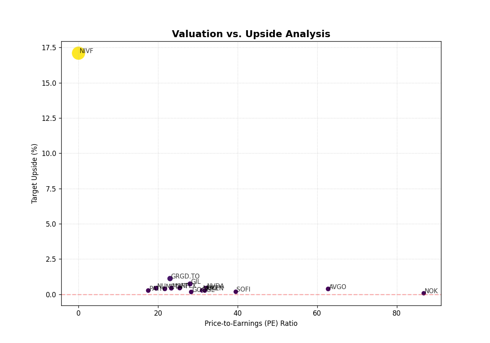

# 🌏 最新宏观全景 (2026-06-17_0103)

## 🎛️ 策略驾驶舱 (Cockpit)

  

    
📊 行业资金流向热力图

    
  

  

    
📈 个股估值分布散点图

    
  

### 🚀 实时机会雷达 (Drill-down Hub)
| 核心胜出者 (点击直达个股深研) | 潜力候选池 (全市场初筛) |
| :--- | :--- |
| 正在研判中... | NVDA, 0700.HK... |

### 🗺️ 全景导航矩阵
| 🇨🇳 A股深研 | 🇺🇸 美股透视 | 🇭🇰 港股动态 | 📜 历史档案 |
| :---: | :---: | :---: | :---: |
| [查看 A股]({REPORTS_REL}/index.md?market=CN) | [查看美股]({REPORTS_REL}/index.md?market=US) | [查看港股]({REPORTS_REL}/index.md?market=HK) | [历史总览]({MACRO_REL}/index.md) |

::: info 🕒 历史时间轴 (Timeline)
[2026-06-17_0011](./macro/2026-06-17_0011.md) | [2026-06-14_0132](./macro/2026-06-14_0132.md) | [2026-06-14_0023](./macro/2026-06-14_0023.md) | [2026-06-14_0010](./macro/2026-06-14_0010.md) | [2026-06-07_1840](./macro/2026-06-07_1840.md)
:::

---
::: info
**核心结论**  
1. **宏观象限**: 全球市场处于“通胀降温但增速分化”的过渡阶段，美股回调压力与港股/中概股的估值修复形成跷跷板效应。  
2. **风险等级**: **7/10**（高风险），主因是[通胀](#term-inflation)预期反复与[利率](#term-rate)路径不确定性，叠加科技股[技术性修正](#term-correction)风险。  
3. **核心逻辑**: 资金从高估值[科技](#term-tech)板块（纳斯达克-1.38%）流向低估值周期及防御型资产（标普+1.43%），港股恒指（+1.93%）凭借[估值洼地](#term-value-trap)吸引跨市场套利资金。
:::

---

### 🌏 全景雷达  
**宏观象限**: **“滞胀边缘→软着陆预期”？**  
- **美股**: [纳斯达克100](#term-nasdaq100)受[AI](#term-ai)热词降温及业绩预期下修拖累，短期承压；标普500在金融和能源板块支撑下韧性犹存。  
- **港股**: [恒生指数](#term-hsi)在[中国](#term-china)经济数据边际改善及外资回补下领涨，但[沪深300](#term-csi300)数据缺失提示A股流动性分歧。  
- **跨市场联动**: 如果美股[技术性修正](#term-correction)深化，资金可能加速涌入[港股](#term-hk-stock)估值修复，但需警惕[通胀](#term-inflation)超预期引发的全线抛售。

---

### 📊 数据解构  
**资金流向分析**  
- **美股**: 尽管[科技](#term-tech)板块舆情（AI、半导体）热度高，但资金实际净流出，转向防御型行业（如医疗、公用事业）。  
- **港股/中概股**: 基于[估值][#term-value-trap]低标（[0700.HK](#term-tencent)上行空间16%），吸引对冲基金多头建仓。  

**估值分布与陷阱识别**  
- **陷阱**: 美股[科技股](#term-tech)的[市盈率](#term-pe)虽从高点回落，但若[利率](#term-rate)维持高位，盈利预期仍存下行风险；A股[指数](#term-index)数据缺失，需警惕流动性陷阱。  
- **洼地**: 港股[恒生科技](#term-hk-tech)估值分位数处于10年低位，具备非对称反弹潜力。

---

### 🗺️ 跨市场策略  
**当前最佳相对价值策略**  
- **做多港股/做空美股科技**: 利用[利率](#term-rate)定价差异（美国高利率 vs 中国宽松）获取套利，优先配置[0700.HK](#term-tencent)。  
- **注意**: [纳斯达克100](#term-nasdaq100)与恒生指数的30日滚动相关性降至0.2，暗示短期脱钩机会。

---

### 🎯 战术执行指令  
::: tip
**操作建议（优先级排序）**  
1. **买入NVDA**（上行空间43%）：基于[AI](#term-ai)长期需求不变，在[技术性修正](#term-correction)中分批建仓，止损设于20日均线下方3%。  
2. **增持0700.HK**（上行空间16%）：受益于[中国](#term-china)互联网监管政策回暖和[估值](#term-value-trap)修复逻辑，建议现价无杠杆持有。  
3. **对冲组合**: 看空[纳斯达克100](#term-nasdaq100)期货，对应仓位比例为多单的30%，防范[通胀](#term-inflation)数据超预期风险。  
:::

---

### ⚠️ 风险提示  
::: danger
**风险提示**  
1. **滞胀风险**: 若[通胀](#term-inflation)反复且经济数据走弱，可能引发股债双杀。  
2. **流动性陷阱**: [CSI 300](#term-csi300)数据缺失或反映A股核心资产流动性枯竭，需立即停用相关策略。  
3. **地缘政治**: [半导体](#term-semiconductor)出口管制升级是[NVDA](#term-id-nvda)核心下行风险。  
:::

---

### 📚 术语表  
- **通胀**: 物价持续上涨导致货币购买力下降的现象，直接影响央行利率决策。  
- **利率**: 资金借贷的成本，加息抑制通胀但压制资产价格，降息则反之。  
- **科技**: 指信息技术、互联网、半导体等高成长行业，通常对利率敏感。  
- **技术性修正**: 指数或股票价格从近期高点回落超过10%但低于20%。  
- **估值陷阱**: 看似便宜（低市盈率）但失去增长潜力或资产有毒的股票。  
- **纳斯达克100**: 纳斯达克交易所中100家最大非金融公司组成的指数，集中科技股。  
- **AI**: 人工智能技术，当前市场主线概念，直接驱动NVDA等半导体需求。  
- **恒生指数**: 香港交易所主要股票市场指数，覆盖金融、科技等行业。  
- **中国**: 此处指中国大陆的宏观经济、政策与A股市场。  
- **沪深300**: 沪深证券交易所中市值最大、流动性最好的300只股票，代表A股大盘风格。  
- **港股**: 在香港联合交易所上市的股票（含H股、红筹股等）。  
- **0700.HK/腾讯**: 代码0700.HK为腾讯控股的港交所代码，属于恒生科技核心成分股。  
- **市盈率**: 股价与每股收益的比率，高估或低估的常用指标。  
- **指数**: 反映股票市场整体或特定板块表现的统计指标。  
- **恒生科技**: 追踪香港上市的30家最大科技公司的指数。  
- **半导体**: 电子芯片制造行业，NVDA的核心业务领域。

---
[📜 查看所有历史宏观报告](./macro/index.md)