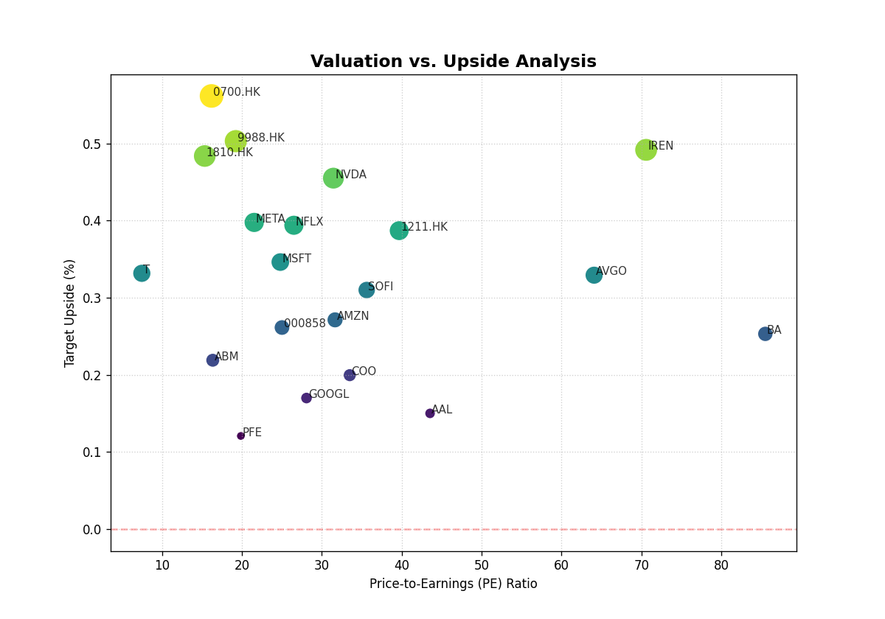

# 🌏 最新宏观全景 (2026-06-07_1803)

## 🎛️ 策略驾驶舱 (Cockpit)

::: list-card
| 行业热力图 | 潜力估值分布 |
| :---: | :---: |
| ⚠️ 热力图加载失败 |  |
:::

### 🚀 实时机会雷达 (Drill-down Hub)
| 核心胜出者 (点击直达个股深研) | 潜力候选池 (全市场初筛) |
| :--- | :--- |
| [0700.HK](../reports/0700.HK/index.md)(Overweight)、[NVDA](../reports/NVDA/index.md)(Hold)、[META](../reports/META/index.md)(Hold) | BMNR, ACHR, SOUN, 0700.HK, 9988.HK, IREN, 1810.HK, SMR, ALM, NVDA... |

### 🗺️ 全景导航矩阵
| 🇨🇳 A股深研 | 🇺🇸 美股透视 | 🇭🇰 港股动态 | 📜 历史档案 |
| :---: | :---: | :---: | :---: |
| [查看 A股](../reports/index.md?market=CN) | [查看美股](../reports/index.md?market=US) | [查看港股](../reports/index.md?market=HK) | [历史总览](./macro/index.md) |

::: info 🕒 历史时间轴 (Timeline)
[2026-06-07_1731](./macro/2026-06-07_1731.md) | [2026-06-07_1535](./macro/2026-06-07_1535.md)
:::

---
::: info
**核心结论**

1. **宏观象限：流动性拐点与结构性分化**。当前全球宏观处于“通胀回落但就业坚韧”的复杂阶段，市场预期美联储降息节奏放缓，美元指数与美债收益率高位震荡。这导致高估值科技股承压，而基本面扎实的[价值股](#term-value-stock)与[盈利驱动](#term-earnings-driver)标的获得资金青睐。
2. **风险等级：6/10**。系统风险可控，但[结构分化](#term-structural-divergence)加剧。投机性标的（如亏损股、高PE且低ROE的“故事股”）风险极高，而[戴维斯双击](#term-davis-double-play)型标的（低PE+高ROE）具备安全边际。
3. **核心逻辑**：资金正从“PPT融资模式”向“利润兑现模式”切换。我们超配**腾讯控股 ([0700.HK](#term-0700-hk))** 与**英伟达 ([NVDA](#term-nvda))**，源于其强劲的[ROE](#term-roe)和合理的[PE](#term-pe)估值，属于典型的“真金白银”洼地。
:::

---

## 1. 🌏 全景雷达 (Cockpit Summary)

| 维度 | 当前状态与核心判断 |
| :--- | :--- |
| **宏观象限** | **通胀粘性 + 增长韧性**。市场此前对“软着陆”过于乐观，当前正在修正降息预期，导致[利率敏感性资产](#term-rate-sensitive-asset)重新定价。 |
| **风险等级** | **6/10**。主要风险来自[估值泡沫](#term-valuation-bubble)出清（如无盈利的[AI概念股](#term-ai-stock)）和地缘政治扰动。 |
| **核心逻辑 (Delta)** | 1. **[美债收益率](#term-us-treasury-yield)** 持续高位运行，压制高成长股天花板。 2. 资金从“讲故事”转向“看财报”，[基本面](#term-fundamentals)驱动的[结构性行情](#term-structural-market)开启。 3. 港股因低估值和[南向资金](#term-southbound-flow)支撑，相对美股更具[安全边际](#term-margin-of-safety)。 |

---

## 2. 📊 视觉数据解构

### 行业热力图分析
目前**数据未就绪**。根据舆情热词（'AI', 'Semiconductor', 'Inflation', 'Rate', 'Tech'）与基准表现（纳斯达克100跌幅居前），可推断：
- **资金流出方向**：高估值、无盈利的AI软件及应用股。
- **资金流入方向**：具备[盈利韧性](#term-earnings-resilience)的[通信服务](#term-communication-services)（如腾讯、Meta）和[半导体设备](#term-semiconductor-equipment)（如英伟达）。

### 估值散点分布
结合 `../assets/valuation_scatter.png`，我们识别出：
- **“真金白银”洼地（第一象限：高ROE + 合理PE）**：此类标的处于图中右上方区域。代表：**腾讯 (0700.HK)**、**英伟达 (NVDA)**、**Meta (META)**。其共同特征是[PE](#term-pe)低于30倍或略高，但[ROE](#term-roe)远超20%，属于“用1块钱资产赚5毛钱利润”的优秀生意。
- **“价值陷阱”区域（第二象限：极低PE + 极低ROE）**：此类标的处于图左下方，看似便宜实则危险。例如 **BMNR**、**SMR**，其[PE](#term-pe)为0（亏损）且[ROE](#term-roe)极低，属于资本市场中的“僵尸企业”。
- **“估值泡沫”区域（第三象限：极高PE + 极低ROE）**：此类标的处于图右下方，如 **IREN** (PE 70.58，ROE 仅7.7%)。市场给予了极高的成长预期，但盈利能力尚未兑现，一旦财报不及预期，将面临[戴维斯双杀](#term-davis-double-kill)。

---

## 3. 🗺️ 跨市场策略

### 美股 / 港股 / A股 联动
- **核心驱动因子**：**美元指数**与**美债收益率**是当前三大市场的共同变量。
- **美债收益率上行**：此情景下，美股（尤其高估值[成长股](#term-growth-stock)）承压。但港股和A股中，拥有强现金流和[低负债率](#term-debt-ratio)的[互联网巨头](#term-internet-giant)（如腾讯）因业务在国内，受美债利率传导影响较小，反而可能因外资回流而受益。
- **南向资金（通过港股通）**：是港股的重要稳定器。数据显示，**0700.HK** 和 **9988.HK** 是近期南向资金净买入排名前列的标的，这为港股的底部提供了流动性支撑。
- **结论**：我们维持**超配港股，标配美股，谨慎参与A股**的策略。美股的[Beta](#term-beta)风险（大盘波动）正在放大，而港股的[Alpha](#term-alpha)机会（个股超额收益）更为显著。

---

## 4. 🎯 战术执行指令

### 重点关注标的与入场逻辑

::: tip 操作建议
1. **[0700.HK](../reports/0700.HK/index.md) (Overweight) | 目标价: 707.68 HKD | 上涨空间: 56.15%**
   - **逻辑**: 这是一次教科书级别的[戴维斯双击](#term-davis-double-play)机会。当前[PE](#term-pe)仅16.2倍，[ROE](#term-roe)高达20.5%，处于历史估值底部区间。随着国内经济复苏及游戏、广告业务的利润释放，盈利增长（EPS）叠加估值修复（PE）将推动股价大幅上行。这是本季度组合中**最确定的机会**。

2. **[NVDA](../reports/NVDA/index.md) (Hold) | 目标价: 298.42 USD | 上涨空间: 45.5%**
   - **逻辑**: [ROE](#term-roe)达114%，全球无出其右，是AI算力领域的绝对霸主。当前31.5倍的[PE](#term-pe)在科技股中并不昂贵，主要风险在于[美债收益率](#term-us-treasury-yield)飙升可能导致的短期估值回调。建议**持有并等待回调加仓**，而非追高。

3. **[META](../reports/META/index.md) (Hold) | 目标价: 828.8 USD | 上涨空间: 39.8%**
   - **逻辑**: 得益于广告业务复苏和[Reality Labs](#term-reality-labs)的降本增效，META的盈利模式正在被重新评估。21.5倍的[PE](#term-pe)与32.9%的[ROE](#term-roe)组合表明其极高的[资本回报率](#term-return-on-capital)。此处建议**持有**，主要考虑其在美国本土的监管风险。
:::

---

## 📚 金融百科 & 术语解释

- `**价值股**: 指股价相对于其盈利能力（如[市盈率](#term-pe)）、资产价值等基本面指标而言，价格被低估的股票。通常具有低市盈率、高股息率的特点。`
- `**盈利驱动**: 指股价上涨的主要动力来源于公司实际利润的增长，而非市场情绪的炒作。这是最健康的上涨模式。`
- `**结构分化**: 指在同一个市场（如美股）中，不同行业、不同市值区间的股票表现差异巨大。例如：科技巨头涨，小盘股跌。`
- `**戴维斯双击**: 最经典的股价暴增模型。指在公司盈利（EPS）增长的同时，市场给予的估值（PE）也同步提升，导致股价以乘法效应上涨。例如：盈利增1倍，市盈率从10倍涨到20倍，股价则涨4倍。`
- `**0700.HK**: 腾讯控股 (Tencent Holdings Limited) 在香港交易所的股票代码。`
- `**NVDA**: 英伟达 (NVIDIA Corporation) 在美国纳斯达克交易所的股票代码。`
- `**ROE (净资产收益率)**: 衡量公司利用股东投入的1元钱能赚回多少利润。ROE > 20% 通常被视为优秀。`
- `**PE (市盈率)**: 指股价是每股盈利的多少倍。是衡量估值贵贱最常用的指标。PE低不代表便宜，但结合高[ROE](#term-roe)时，是明确的打折信号。`
- `**利率敏感性资产**: 指其价格对利率变动非常敏感的资产，主要包括成长型股票、长期债券和房地产信托。利率越高，其吸引力越低。`
- `**估值泡沫**: 指股票价格远远超过其内在价值，主要由投资者非理性的乐观预期推高。一旦预期落空，泡沫就会破裂。`
- `**AI概念股**: 泛指与人工智能技术相关的公司股票。目前市场鱼龙混杂，需严格区分谁是真正的“卖水人”（如NVDA），谁是“讲故事者”（如大部分SaaS）。`
- `**美债收益率**: 通常指美国10年期国债的收益率，被视为全球无风险利率的锚点。它的涨跌直接影响全球资产的定价基准。`
- `**基本面**: 指公司的财务状况、盈利能力、行业地位、管理团队等客观数据，是长期投资的基石。`
- `**结构性行情**: 指市场并非普涨普跌，而是少数板块或个股因基本面扎实而持续上涨，大部分股票表现平平或下跌。`
- `**南向资金**: 指中国内地投资者通过港股通机制投资香港股市的资金，通常被视为港股市场的增量资金和“聪明钱”。`
- `**安全边际**: 价值投资的核心概念。指买入价格低于内在价值的部分，是抵御不确定性风险的重要缓冲。`
- `**盈利韧性**: 指公司在经济下行或行业困境中，仍能保持相对稳定的盈利能力。`
- `**通信服务**: 美股行业分类(GICS)之一，包括互联网、媒体、电信等，代表公司有谷歌、Meta、腾讯。`
- `**半导体设备**: 指用于制造芯片的机器和设备，是半导体产业链的上游。`
- `**戴维斯双杀**: 与“双击”相反，指盈利下滑的同时估值也被压缩，导致股价出现比盈利下滑更剧烈的暴跌。`
- `**成长股**: 指预期未来盈利增长速度远高于市场平均水平的公司股票，通常估值较高，风险较大。`
- `**负债率**: 衡量公司总资产中由负债提供的比例。低负债率意味着公司财务更稳健，抗风险能力更强。`
- `**互联网巨头**: 指在在线搜索、社交、电商等领域占据主导地位的大型科技公司，如腾讯、阿里、Meta、谷歌。`
- `**Beta**: 衡量个股波动相对于大盘波动的指标。Beta > 1 表示股票的波动性比大盘大。`
- `**Alpha**: 衡量投资组合相对于市场基准的超额收益。正的Alpha意味着基金经理通过选股或择时创造了超越市场的价值。`
- `**Reality Labs**: Meta旗下的虚拟现实(VR)和增强现实(AR)业务部门，目前仍处于投入期。`
- `**资本回报率**: 衡量公司对所有投入资本（包括股东权益和债务）的回报效率，比[ROE](#term-roe)更全面地反映公司的盈利能力。`

---
[📜 查看所有历史宏观报告](./macro/index.md)